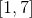
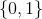
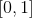

# An&aacute;lise do consenso como indicativo de qualidade em f&oacute;runs MOOC <!--{style=text-align:center}-->

   

#### Resumo <!--{style=text-align:justify}-->
Discuss&atilde;es em chats e f&oacute;runs de plataformas de ensino online, como aquelas para Massive Open Online Couses - MOOC, servem para construir conclus&otilde;es consensuais que agreguem valor pedag&oacute;gico. O estudo da correla&ccedil;&atilde;o entre consenso e a qualidade da conclus&atilde;o em discuss&otilde;es online tem recebido pouca aten&ccedil;&atilde;o. Este artigo usa *Soft Consensus* - quando h&aacute; grada&ccedil;&atilde;o do consenso, desde nenhum at&eacute; unanimidade - para apresentar um estudo estat&iacute;stico onde tal correla&ccedil;&atilde;o &eacute; medida a partir de dados de f&oacute;runs de MOOC e o apoio dos instrutores &agrave; conclus&atilde;o consensual &eacute; o indicador de qualidade. Resultados preliminares apontam uma correla&ccedil;&atilde;o negativa.

   

## Introdu&ccedil;&atilde;o

Fóruns de discussão e debates online são importantes elementos de suporte ao aprendizado, onde o debate oferece ao estudante maior clareza acerca de um dado tema. Em tais fóruns, quando uma discussão é aberta, é natural criar-se uma expectativa de conclusão, seja esta consensual ou definitiva. Diante da dificuldade de se alcançar conclusões definitivas em certos temas de debate, o consenso ganha força como instrumento de avaliação de qualidade da solução proposta. Aqui, "consenso" é definido como segue.

**Definição 1:** "Consenso" é uma medida de concordância entre as respostas ou opiniões de um grupo de indivíduos sobre determinada questão ou assunto. 

A definição 1 permite modelar de uma concordância parcial à unanimidade. A definição se baseia naquela de soft *consensus* [Herrera-Viedma et al. 2014] que acomoda incertezas.

Embora a pesquisa sobre consenso tenha evoluído e se adaptado aos domínios virtuais, com base em nossos levantamentos, não encontramos pesquisas que apontem se uma decisão consensual é de fato uma decisão de qualidade em ambientes de discussões online. Por conjectura, podemos apontar a dificuldade em se obter dados de discussões online para análise, cujas conclusões estejam classificadas em função da qualidade. Neste estudo, tal dificuldade foi contornada utilizando-se dados oriundos de fóruns de MOOCs (do inglês, *Massive Open Online Courses*), tomando o apoio do corpo de instrutores à conclusão consensual como parâmetro de qualidade.

Este repositório oferece o ferramental necessário a medir a correlação entre consenso e qualidade em discussões online a partir de uma base de dados de postagens de fóruns educacionais oriundos de 12 MOOC diferentes oferecidos pela Universidade de Stanford (www.stanford.edu) na plataforma edX (www.edx.org). O consenso entre estas postagens em cada discussão foi calculado com base em três diferentes métricas de distância textual para avaliar o ruído introduzido por tais métricas.

Após conhecer o consenso e a qualidade das discussões por toda a base de dados, segui-se à análise estatística de tais dados. Para tanto, a pasta ``analysis`` oferece o ferramental necessário - além de uma breve descrição - para um estudo preliminar envolvendo intervalo de confiança e *Bootstraping* a partir da média de apoio dos instrutores à decisão consensual e outro mais aprofundado com base em Regressão Logística. Com isto, pode--se observar indícios de que o consenso tem efeito negativo na qualidade da decisão.

## Os Dados

Os dados utilizados nesta pesquisa estão disponíveis na pasta ``data`` e são fruto de discussões em fóruns de 12 MOOC ofertados em Inglês pela Universidade de Stanford na plataforma edX entre 2013 e 2015. Tais MOOC abrangiam três áreas do conhecimento: Ciências Humanas, Medicina e Educação; totalizando 29.604 postagens agrupadas em 22.804 discussões. As discussões podem ainda ser divididas do seguinte modo: 20.268 tendo apenas uma postagem; 2.208 tendo entre 2 e 5 postagens; 179 tendo entre 6 e 10 postagens; e 48 com mais de 11 postagens. Aqui, apenas as discussões com pelo menos duas postagens foram utilizadas.

### Tratamento manual

Os dados foram utilizados originalmente por [Agrawal et al. 2015]. Por razões éticas, Agrawal et al filtraram todas as referências nominais aos autores de cada postagem, preservando assim seu anonimato. Em seguida, eles ponderaram manualmente as postagens dos estudantes por urgência  - i.e., a faixa de números inteiros $\geq$ 1 e $\leq$ 7, onde 1 representa a menor urgência e 7, a maior; positividade ; e, confusão . As postagens foram ainda classificadas como pergunta  - não ou sim, respectivamente; resposta ; ou, opinião . Deve-se notar que o campo "confusão" parece ter sido mensurado em escala invertida, medindo na verdade a "convicção" em cada postagem. 

Com os dados já tratados, classificamos manualmente cada postagem como sendo de autoria ou não de um instrutor $\{0,1\}$. Além disto, urgência, positividade e confusão (convicção) foram mapeados para a faixa de números decimais , afim de normalizar nossa análise.

### Tratamento Automático

Antes de efetuar os cálculos de consenso, algumas providências foram tomadas. Com o objetivo de melhorar o desempenho dos algoritmos de distância textual, sinais de pontuação foram substituídos por espaços em branco e todos os *tokens* (palavras, numerais, *links*, etc, desde que delimitados por espaços em branco) com dois caracteres ou menos, foram eliminados. Em seguida foi aplicada uma estratégia de remoção de *stop words* (palavras com pouca informação semântica como "de", "para", "por", etc) a partir da biblioteca Java Opennpl (opennlp.apache.org) da Apache Foundation (www.apache.org).

## Mensurando Consenso

Como já adiantando quando da Definição 1, *Soft Consensus* é um conceito onde o consenso é definido a partir de modelos capazes de assimilar incerteza [Herrera-Viedma et al. 2014]. Contudo, tal potencial diz respeito apenas a quantificadores linguísticos e Lógica Difusa. A maioria destes modelos segue metodologias rígidas divididas em rodadas de discussão e geralmente moderadas por um agente externo [Cabrerizo et al. 2015], embora haja alternativas mais flexíveis [Alonso et al. 2013]. Como estamos lidando com discussões já finalizadas e agentes dispersos no tempo, além de pouco comprometidos com o debate, mesmo metodologias mais flexíveis ainda necessitam de certos ajustes para se enquadrarem ao nosso propósito. Em face a isto, tomamos toda a discussão como sendo uma única rodada de debate e cada postagem como um agente individualizado. Como já mencionado, a base de dados utilizada já discrimina opiniões, perguntas e respostas. Deste modo, ainda tomamos as postagens discriminadas como "opinião" como as alternativas disponíveis para consideração. A distância textual entre uma postagem e cada uma das opiniões mede o nível de apoio que aquela postagem oferecia a cada opinião.

Métricas de distância textual podem introduzir ruído na análise, e de acordo com [Gomaa and Fahmy 2013] existem três classes principais de algoritmos de similaridade textual. Diante disto, analisou-se o consenso em função de três algoritmos de distância textual diferentes, um para cada classe, comparando os resultados. A primeira classe, e mais simplista delas, é a similaridade baseada em caracteres. Optamos por adotar a distância de edição ou distância de Damerau-Levenshtein, por ser a mais difundida. A segunda classe de algoritmos mede a distância semântica com base em Corpus textuais de vários idiomas, dentre eles o Inglês. Para esta, utilizou-se o algoritmo DISCO [Kolb 2008], por se tratar de uma tecnologia bem estabelecia e com implementação robusta. A terceira e ultima classe de algoritmos traz algoritmos baseados em redes semânticas de palavras e expressões. Para esta classe, aplicou-se um algoritmo baseado em Wordnet [Miller 1998], por dispor implementação bastante estável.

Nosso processo semi estruturado para cálculo de consenso segue uma sequência simples: Identificam-se as opiniões dentre as postagens de uma discussão; calcula-se a matriz de preferências comparando todas as opiniões dois a dois (conforme descrito na Seção *Soft Consensus*, a seguir); a partir da matriz de preferências, calculam-se similaridades entre tais preferências e ordenam-se as opiniões tanto no âmbito geral quanto para cada postagem individualizada; e, por fim, verifica-se o nível de consenso.

### Distância Textual

dfgdgdf
